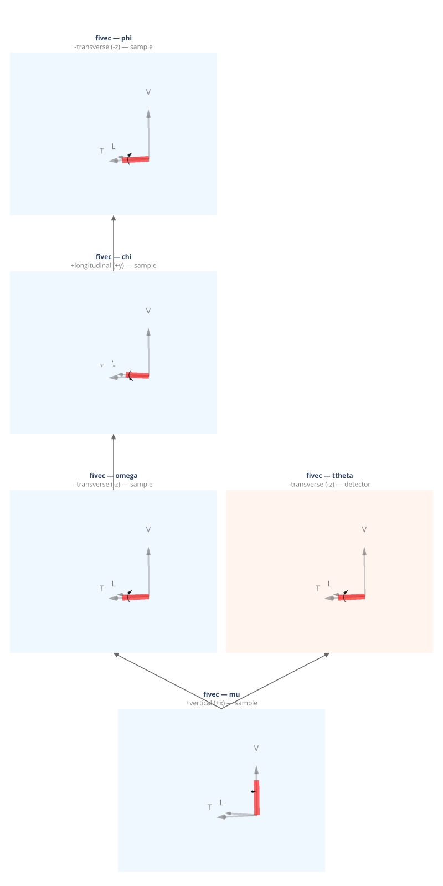

(geometry-fivec)=
# fivec — Eulerian Five-Circle (Vlieg et al. 1987)

Five-circle diffractometer: a standard {func}`~ad_hoc_diffractometer.presets.fourcv` (Eulerian four-circle) mounted on a vertical mu base stage. Sample and detector are coupled through mu.

**Walko (2016) designation:** (S3D1)1

**Coordinate basis:** You (1999) ({data}`~ad_hoc_diffractometer.factories.BASIS_YOU`): vertical=+x, longitudinal=+y, transverse=+z.

## Quick start

```python
import ad_hoc_diffractometer as ahd

g = ahd.presets.fivec()
g.wavelength = 1.0  # Å
print(g.summary())
```

## Pre-built geometry definition

This geometry is defined by the {func}`~ad_hoc_diffractometer.presets.fivec` factory
function — see the [source](https://github.com/prjemian/ad_hoc_diffractometer/blob/main/src/ad_hoc_diffractometer/factories.py#L1147) for the complete stage
and mode configuration.

## Stage layout

<iframe
  src="../_static/geometries/fivec/fivec.html"
  width="100%"
  height="1630px"
  style="border:none;"
  loading="lazy">
</iframe>

```{raw} html
<details>
<summary>Static fallback (click to expand if the interactive figure above is blank)</summary>
```



```{raw} html
</details>
```

**Sample stages (base first):**

| Stage | Axis | Handedness | Parent |
|---|---|---|---|
| ``mu`` | +vertical (+x) | right-handed, shared base | base |
| ``omega`` | −transverse (−z) | left-handed | ``mu`` |
| ``chi`` | +longitudinal (+y) | right-handed | ``omega`` |
| ``phi`` | −transverse (−z) | left-handed | ``chi`` |

**Detector stages (base first):**

| Stage | Axis | Handedness | Parent |
|---|---|---|---|
| ``ttheta`` | −transverse (−z) | left-handed | ``mu`` |

**Shared stage:** mu (base stage shared between sample and detector stacks)

## Diffraction modes

Set the active mode with `g.mode_name = "<mode>"`.
Each mode is a {class}`~ad_hoc_diffractometer.mode.ConstraintSet` of 2 constraints
(N − 3 = 2 for N = 5 DOF).
With mu = 0, {func}`~ad_hoc_diffractometer.presets.fivec` reduces identically to {func}`~ad_hoc_diffractometer.presets.fourcv`.
See {doc}`../howto/modes` for usage and {doc}`../howto/constraints` for
changing constraint values at run time.

### `bisecting_4c` *(default)*

{class}`~ad_hoc_diffractometer.mode.SampleConstraint` + {class}`~ad_hoc_diffractometer.mode.BisectConstraint`:
`mu = 0`, `omega = ttheta / 2`.
Reduces to standard four-circle bisecting geometry.

| | |
|---|---|
| **Computed** | omega, chi, phi, ttheta |
| **Constant during** `forward()` | mu = 0 |

### `fixed_chi`

{class}`~ad_hoc_diffractometer.mode.SampleConstraint` × 2:
`mu = 0`.
`chi` is held at the value declared in the constraint (factory default: 90°).
The caller chooses the value by constructing a {class}`~ad_hoc_diffractometer.mode.ConstraintSet`; the constraint
persists until replaced — see {doc}`../howto/constraints`.

| | |
|---|---|
| **Computed** | omega, phi, ttheta |
| **Constant during** `forward()` | mu = 0, chi |

### `fixed_phi`

{class}`~ad_hoc_diffractometer.mode.SampleConstraint` × 2:
`mu = 0`.
`phi` is held at the value declared in the constraint (factory default: 0°).
The caller chooses the value by constructing a {class}`~ad_hoc_diffractometer.mode.ConstraintSet`.

| | |
|---|---|
| **Computed** | omega, chi, ttheta |
| **Constant during** `forward()` | mu = 0, phi |

### `fixed_mu`

{class}`~ad_hoc_diffractometer.mode.SampleConstraint` + {class}`~ad_hoc_diffractometer.mode.BisectConstraint`:
`omega = ttheta / 2`.
`mu` is held at the value declared in the constraint (factory default: 0°).
The caller chooses the value by constructing a {class}`~ad_hoc_diffractometer.mode.ConstraintSet`.
Intended for non-zero mu once the tilted-plane solver is implemented.

| | |
|---|---|
| **Computed** | omega, chi, phi, ttheta |
| **Constant during** `forward()` | mu |

### `constant_omega_noncoplanar`

{class}`~ad_hoc_diffractometer.mode.SampleConstraint` × 2:
`mu = 0`.
`omega` is held at the value declared in the constraint (factory default: 0°).
The caller chooses the value by constructing a {class}`~ad_hoc_diffractometer.mode.ConstraintSet`.

| | |
|---|---|
| **Computed** | mu, chi, phi, ttheta |
| **Constant during** `forward()` | mu = 0, omega |

## API reference

- {func}`~ad_hoc_diffractometer.presets.fivec`
- {class}`~ad_hoc_diffractometer.diffractometer.AdHocDiffractometer`
- {class}`~ad_hoc_diffractometer.mode.ConstraintSet`
- {class}`~ad_hoc_diffractometer.mode.BisectConstraint`
- {class}`~ad_hoc_diffractometer.mode.SampleConstraint`
- {class}`~ad_hoc_diffractometer.mode.DetectorConstraint`
- {exc}`~ad_hoc_diffractometer.mode.EwaldSphereViolation`
- {exc}`~ad_hoc_diffractometer.mode.ConstraintViolation`

## References

- Vlieg et al., *J. Appl. Cryst.* **20**, 330–337 (1987). DOI: [10.1107/S0021889887087266](https://doi.org/10.1107/S0021889887087266)
- Walko, *Ref. Module Mater. Sci. Mater. Eng.* (2016).
