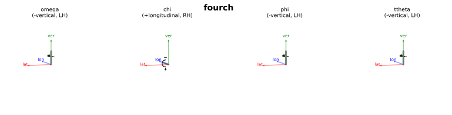
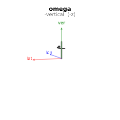
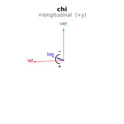
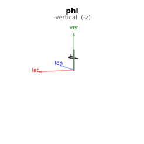
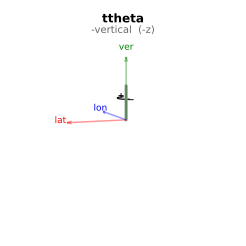

(geometry-fourch)=
# fourch — Eulerian Four-Circle (Laboratory)

Busing & Levy (1967) four-circle Eulerian diffractometer, horizontal scattering plane. ω and 2θ rotate about the vertical axis. Standard laboratory convention.

**Walko (2016) designation:** S3D1

**Coordinate basis:** Busing & Levy ({data}`~ad_hoc_diffractometer.factories.BASIS_BL`): lateral=+x, longitudinal=+y, vertical=+z.

## Quick start

```python
import ad_hoc_diffractometer as ahd

g = ahd.presets.fourch()
g.wavelength = 1.0  # Å
print(g.summary())
```

## Pre-built geometry definition

This geometry is defined by the {func}`~ad_hoc_diffractometer.presets.fourch` factory
function — see the [source](https://github.com/prjemian/ad_hoc_diffractometer/blob/main/src/ad_hoc_diffractometer/factories.py#L613) for the complete stage
and mode configuration.

## Stage layout

### Stage coupling

```{graphviz}
digraph fourch {
    rankdir=BT;
    label="fourch";
    labelloc=t;
    fontsize=14;
    node [shape=box, style=filled, fontsize=11];

    omega [label="omega\naxis: -vertical\nLH", fillcolor="#a8d8ea"];
    chi [label="chi\naxis: +longitudinal\nRH", fillcolor="#a8d8ea"];
    phi [label="phi\naxis: -vertical\nLH", fillcolor="#a8d8ea"];
    ttheta [label="ttheta\naxis: -vertical\nLH", fillcolor="#f8a5a5"];

    { rank=same; omega; ttheta; }

    chi -> omega;
    phi -> chi;

    // Legend
    subgraph cluster_legend {
        label="Legend";
        fontsize=8;
        style=dashed;
        color=gray;
        sample_legend [label="sample", fillcolor="#a8d8ea", shape=box, style=filled, fontsize=7];
        detector_legend [label="detector", fillcolor="#f8a5a5", shape=box, style=filled, fontsize=7];
        sample_legend -> detector_legend [style=invis];
    }
}
```

### Axis overview



### Per-stage axis diagrams

::::{tab-set}
:::{tab-item} omega

:::
:::{tab-item} chi

:::
:::{tab-item} phi

:::
:::{tab-item} ttheta

:::
::::

**Sample stages (base first):**

| Stage | Axis | Handedness |
|---|---|---|
| ``omega`` | −vertical (−z BL) | left-handed |
| ``chi`` | +longitudinal (+y BL) | right-handed |
| ``phi`` | −vertical (−z BL) | left-handed |

**Detector stages (base first):**

| Stage | Axis | Handedness |
|---|---|---|
| ``ttheta`` | −vertical (−z BL) | left-handed |

## Diffraction modes

Set the active mode with `g.mode_name = "<mode>"`.
Each mode is a {class}`~ad_hoc_diffractometer.mode.ConstraintSet` of 1 constraint
(N − 3 = 1 for N = 4 DOF).
See {doc}`../howto/modes` for usage and {doc}`../howto/constraints` for
changing constraint values at run time.

### `bisecting` *(default)*

{class}`~ad_hoc_diffractometer.mode.BisectConstraint`:
`omega = ttheta / 2`.
Places the sample symmetrically between the incident and diffracted beams.

| | Stages |
|---|---|
| **Computed** | omega, chi, phi, ttheta |
| **Constant during** `forward()` | — |

### `fixed_chi`

{class}`~ad_hoc_diffractometer.mode.SampleConstraint`:
`chi` is held at the value declared in the constraint (factory default: 90°).
The caller chooses the value by constructing a {class}`~ad_hoc_diffractometer.mode.ConstraintSet`; the constraint
persists until replaced — see {doc}`../howto/constraints`.

| | |
|---|---|
| **Computed** | omega, phi, ttheta |
| **Constant during** `forward()` | chi |

### `fixed_phi`

{class}`~ad_hoc_diffractometer.mode.SampleConstraint`:
`phi` is held at the value declared in the constraint (factory default: 0°).
The caller chooses the value by constructing a {class}`~ad_hoc_diffractometer.mode.ConstraintSet`.

| | |
|---|---|
| **Computed** | omega, chi, ttheta |
| **Constant during** `forward()` | phi |

### `constant_omega`

{class}`~ad_hoc_diffractometer.mode.SampleConstraint`:
`omega` is held at the value declared in the constraint (factory default: 0°).
The caller chooses the value by constructing a {class}`~ad_hoc_diffractometer.mode.ConstraintSet`.

| | |
|---|---|
| **Computed** | chi, phi, ttheta |
| **Constant during** `forward()` | omega |

### `psi_constant`

{class}`~ad_hoc_diffractometer.mode.ReferenceConstraint`:
azimuthal angle ψ validation filter.
Set ``g.azimuthal_reference = (h, k, l)`` before calling ``forward()``.
Returns bisecting solutions only when the natural ψ for (h,k,l) matches
the stored target.  See {doc}`../howto/surface`.

| | |
|---|---|
| **Extras (input)** | n̂ (reference vector), ψ (target, degrees) |
| **Extras (output)** | psi (computed azimuth) |

### `double_diffraction`

Full 4D simultaneous solver: finds motor angles where both the primary
(h₁,k₁,l₁) and secondary (h₂,k₂,l₂) reflections satisfy the Ewald
sphere condition.  Set ``mode.extras['h2']``, ``['k2']``, ``['l2']``
before calling ``forward()``.

| | |
|---|---|
| **Computed** | omega, chi, phi, ttheta |
| **Extras (input)** | h₂, k₂, l₂ (secondary reflection Miller indices) |

## API reference

- {func}`~ad_hoc_diffractometer.presets.fourch`
- {class}`~ad_hoc_diffractometer.geometry.AdHocDiffractometer`
- {class}`~ad_hoc_diffractometer.mode.ConstraintSet`
- {class}`~ad_hoc_diffractometer.mode.BisectConstraint`
- {class}`~ad_hoc_diffractometer.mode.SampleConstraint`
- {class}`~ad_hoc_diffractometer.mode.DetectorConstraint`
- {class}`~ad_hoc_diffractometer.mode.ReferenceConstraint`
- {exc}`~ad_hoc_diffractometer.mode.EwaldSphereViolation`
- {exc}`~ad_hoc_diffractometer.mode.ConstraintViolation`

## References

- Busing & Levy, *Acta Cryst.* **22**, 457–464 (1967). DOI: [10.1107/S0365110X67000970](https://doi.org/10.1107/S0365110X67000970)
- Walko, *Ref. Module Mater. Sci. Mater. Eng.* (2016).
