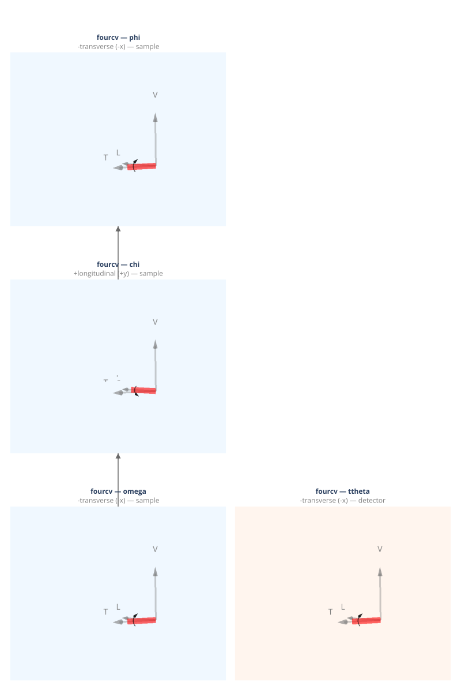

(geometry-fourcv)=
# fourcv — Eulerian Four-Circle (vertical)

Busing & Levy (1967) four-circle Eulerian diffractometer, vertical scattering plane. ω and 2θ rotate about the transverse axis. Standard synchrotron convention.

**Walko (2016) designation:** S3D1

**Coordinate basis:** Busing & Levy ({data}`~ad_hoc_diffractometer.factories.BASIS_BL`): transverse=+x, longitudinal=+y, vertical=+z.

## Quick start

```python
import ad_hoc_diffractometer as ahd

g = ahd.make_geometry("fourcv")
g.wavelength = 1.0  # Å
print(g.summary())
```

## Demo geometry definition

This geometry is defined by the {ref}`geometry-fourcv` factory
function — see the [source](https://github.com/BCDA-APS/ad_hoc_diffractometer/blob/main/src/ad_hoc_diffractometer/geometries/fourcv.yml) for the complete stage
and mode configuration.

## Stage layout

<iframe
  src="../_static/geometries/fourcv/fourcv.html"
  width="100%"
  height="1230px"
  style="border:none;"
  loading="lazy">
</iframe>

```{raw} html
<details>
<summary>Static fallback (click to expand if the interactive figure above is blank)</summary>
```



```{raw} html
</details>
```

**Sample stages (base first):**

| Stage | Axis | Handedness | Parent |
|---|---|---|---|
| ``omega`` | −transverse (−x BL) | left-handed | base |
| ``chi`` | +longitudinal (+y BL) | right-handed | ``omega`` |
| ``phi`` | −transverse (−x BL) | left-handed | ``chi`` |

**Detector stages (base first):**

| Stage | Axis | Handedness | Parent |
|---|---|---|---|
| ``ttheta`` | −transverse (−x BL) | left-handed | base |

## Diffraction modes

Set the active mode with `g.mode_name = "<mode>"`.
Each mode is a {class}`~ad_hoc_diffractometer.mode.ConstraintSet` of 1 constraint
(N − 3 = 1 for N = 4 DOF).
See {doc}`../howto/modes` for usage and {doc}`../howto/constraints` for
changing constraint values at run time.

### `bisecting` *(default)*

{class}`~ad_hoc_diffractometer.mode.BisectConstraint`:
`omega = ttheta / 2`.
Places the sample symmetrically between the incident and diffracted beams.

| | Stages |
|---|---|
| **Computed** | omega, chi, phi, ttheta |
| **Constant during** `forward()` | — |

### `fixed_chi`

{class}`~ad_hoc_diffractometer.mode.SampleConstraint`:
`chi` is held at the value declared in the constraint (default in the demo geometry: 90°).
Override at run time with `g.modes["fixed_chi"].with_constraint_values(chi=...)` — see {doc}`../howto/constraints`.

| | |
|---|---|
| **Computed** | omega, phi, ttheta |
| **Constant during** `forward()` | chi |

### `fixed_phi`

{class}`~ad_hoc_diffractometer.mode.SampleConstraint`:
`phi` is held at the value declared in the constraint (default in the demo geometry: 0°).
Override at run time with `g.modes["fixed_phi"].with_constraint_values(phi=...)` — see {doc}`../howto/constraints`.

| | |
|---|---|
| **Computed** | omega, chi, ttheta |
| **Constant during** `forward()` | phi |

### `fixed_omega`

{class}`~ad_hoc_diffractometer.mode.SampleConstraint`:
`omega` is held at the value declared in the constraint (default in the demo geometry: 0°).
Override at run time with `g.modes["fixed_omega"].with_constraint_values(omega=...)` — see {doc}`../howto/constraints`.

| | |
|---|---|
| **Computed** | chi, phi, ttheta |
| **Constant during** `forward()` | omega |

### `fixed_psi`

{class}`~ad_hoc_diffractometer.mode.ReferenceConstraint`:
azimuthal angle ψ validation filter.
Set ``g.azimuthal_reference = (h, k, l)`` before calling ``forward()``.
Returns bisecting solutions only when the natural ψ for (h,k,l) matches
the stored target.  See {doc}`../howto/surface`.

| | |
|---|---|
| **Extras (input)** | n̂ (reference vector), ψ (target, degrees) |
| **Extras (output)** | psi (computed azimuth) |

### `double_diffraction`

Full 4D simultaneous solver: finds motor angles where both the primary
(h₁,k₁,l₁) and secondary (h₂,k₂,l₂) reflections satisfy the Ewald
sphere condition.  Set ``mode.extras['h2']``, ``['k2']``, ``['l2']``
before calling ``forward()``.

| | |
|---|---|
| **Computed** | omega, chi, phi, ttheta |
| **Extras (input)** | h₂, k₂, l₂ (secondary reflection Miller indices) |

## API reference

- {ref}`geometry-fourcv`
- {class}`~ad_hoc_diffractometer.diffractometer.AdHocDiffractometer`
- {class}`~ad_hoc_diffractometer.mode.ConstraintSet`
- {class}`~ad_hoc_diffractometer.mode.BisectConstraint`
- {class}`~ad_hoc_diffractometer.mode.SampleConstraint`
- {class}`~ad_hoc_diffractometer.mode.DetectorConstraint`
- {class}`~ad_hoc_diffractometer.mode.ReferenceConstraint`
- {exc}`~ad_hoc_diffractometer.mode.EwaldSphereViolation`
- {exc}`~ad_hoc_diffractometer.mode.ConstraintViolation`

## References

- Busing & Levy, *Acta Cryst.* **22**, 457–464 (1967). DOI: [10.1107/S0365110X67000970](https://doi.org/10.1107/S0365110X67000970)
- Walko, *Ref. Module Mater. Sci. Mater. Eng.* (2016).
