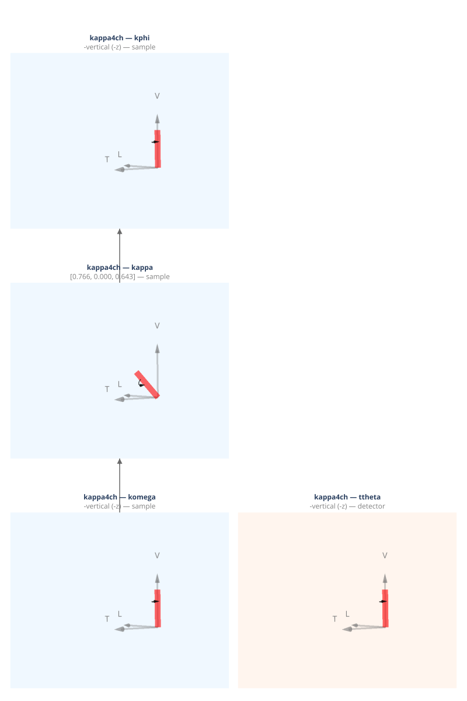

(geometry-kappa4ch)=
# kappa4ch — Kappa Four-Circle (Laboratory)

Four-circle kappa diffractometer, horizontal scattering plane. Kappa axis tilted at α = 50° from vertical. Laboratory convention.

**Walko (2016) designation:** S3D1 (kappa)

**Coordinate basis:** Busing & Levy ({data}`~ad_hoc_diffractometer.factories.BASIS_BL`): transverse=+x, longitudinal=+y, vertical=+z.

## Quick start

```python
import ad_hoc_diffractometer as ahd

g = ahd.presets.kappa4ch()
g.wavelength = 1.0  # Å
print(g.summary())
```

## Pre-built geometry definition

This geometry is defined by the {func}`~ad_hoc_diffractometer.presets.kappa4ch` factory
function — see the [source](https://github.com/prjemian/ad_hoc_diffractometer/blob/main/src/ad_hoc_diffractometer/factories.py#L964) for the complete stage
and mode configuration.

## Stage layout

<iframe
  src="../_static/geometries/kappa4ch/kappa4ch.html"
  width="100%"
  height="1230px"
  style="border:none;"
  loading="lazy">
</iframe>

```{raw} html
<details>
<summary>Static fallback (click to expand if the interactive figure above is blank)</summary>
```



```{raw} html
</details>
```

**Sample stages (base first):**

| Stage | Axis | Handedness | Parent |
|---|---|---|---|
| ``komega`` | −vertical (−z BL) | left-handed | base |
| ``kappa`` | tilted axis, α=50° | right-handed | ``komega`` |
| ``kphi`` | −vertical (−z BL) | left-handed | ``kappa`` |

**Detector stages (base first):**

| Stage | Axis | Handedness | Parent |
|---|---|---|---|
| ``ttheta`` | −vertical (−z BL) | left-handed | base |

**Virtual Eulerian angles** (computed from real kappa angles via Walko 2016 eq. [16]):
omega, chi, phi.  Used as constraint names for stub modes; converted back to
komega, kappa, kphi by the kappa inversion solver (Issue I / #153).

## Diffraction modes

Each mode is a {class}`~ad_hoc_diffractometer.mode.ConstraintSet` of 1 constraint
(N − 3 = 1 for N = 4 DOF).
Identical mode set to {doc}`kappa4cv`.
See {doc}`../howto/modes` for usage and {doc}`../howto/constraints` for
changing constraint values at run time.

### `bisecting` *(default)*

{class}`~ad_hoc_diffractometer.mode.BisectConstraint`:
`komega = ttheta / 2` (approximates the bisecting condition).

> **Note:** The correct bisecting condition is virtual `omega_euler = 0`.
> Corrected in Issue I / #153.

| | |
|---|---|
| **Computed** | komega, kappa, kphi, ttheta |
| **Constant during** `forward()` | — |

### `fixed_kphi`

{class}`~ad_hoc_diffractometer.mode.SampleConstraint`:
`kphi` held at declared value (default 0°) — real stage, no kappa inversion needed.

| | |
|---|---|
| **Computed** | komega, kappa, ttheta |
| **Constant during** `forward()` | kphi |

### `fixed_omega`

Fix virtual Eulerian omega at declared value (default 0°) — see {doc}`kappa4cv` for details.

| | |
|---|---|
| **Computed** | komega, kappa, kphi, ttheta |
| **Constant during** `forward()` | omega (virtual) |

### `fixed_chi`

Fix virtual Eulerian chi at declared value (default 90°).

| | |
|---|---|
| **Computed** | komega, kappa, kphi, ttheta |
| **Constant during** `forward()` | chi (virtual) |

### `fixed_phi`

Fix virtual Eulerian phi at declared value (default 0°).

| | |
|---|---|
| **Computed** | komega, kappa, kphi, ttheta |
| **Constant during** `forward()` | phi (virtual) |

### `fixed_psi`

{class}`~ad_hoc_diffractometer.mode.ReferenceConstraint`:
azimuthal angle ψ validation filter.
Set ``g.azimuthal_reference = (h, k, l)`` before calling ``forward()``.
Returns bisecting solutions only when the natural ψ for (h,k,l) matches
the stored target.  See {doc}`../howto/surface`.

| | |
|---|---|
| **Extras (input)** | n̂ (reference vector), ψ (target azimuth, degrees) |
| **Extras (output)** | psi (computed azimuth) |

## API reference

- {func}`~ad_hoc_diffractometer.presets.kappa4ch`
- {class}`~ad_hoc_diffractometer.diffractometer.AdHocDiffractometer`
- {class}`~ad_hoc_diffractometer.mode.ConstraintSet`
- {class}`~ad_hoc_diffractometer.mode.BisectConstraint`
- {class}`~ad_hoc_diffractometer.mode.SampleConstraint`
- {class}`~ad_hoc_diffractometer.mode.ReferenceConstraint`
- {class}`~ad_hoc_diffractometer.mode.EwaldSphereViolation`
- {class}`~ad_hoc_diffractometer.mode.ConstraintViolation`

## References

- ITC Vol. C §2.2.6 (2006). DOI: [10.1107/97809553602060000577](https://doi.org/10.1107/97809553602060000577)
- Walko, *Ref. Module Mater. Sci. Mater. Eng.* (2016), eq. [16].
