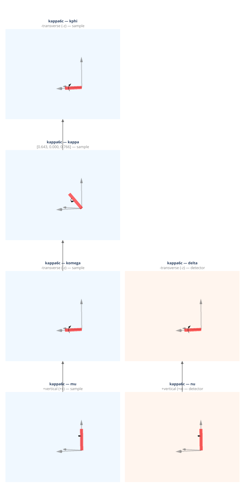

(geometry-kappa6c)=
# kappa6c — Kappa Six-Circle

Six-circle kappa diffractometer with psic-style outer axes (mu, nu). The inner
sample axes (komega, kappa, and kphi) replace the Eulerian chi circle.
Transverse detector, vertical scattering plane.

**Coordinate basis:** You (1999) ({data}`~ad_hoc_diffractometer.factories.BASIS_YOU`): vertical=+x, longitudinal=+y, transverse=+z.

## Quick start

```python
import ad_hoc_diffractometer as ahd

g = ahd.presets.kappa6c()
g.wavelength = 1.0  # Å
print(g.summary())
```

## Demo geometry definition

This geometry is defined by the {func}`~ad_hoc_diffractometer.presets.kappa6c` factory
function — see the [source](https://github.com/prjemian/ad_hoc_diffractometer/blob/main/src/ad_hoc_diffractometer/factories.py#L1049) for the complete stage
and mode configuration.

## Stage layout

<iframe
  src="../_static/geometries/kappa6c/kappa6c.html"
  width="100%"
  height="1630px"
  style="border:none;"
  loading="lazy">
</iframe>

```{raw} html
<details>
<summary>Static fallback (click to expand if the interactive figure above is blank)</summary>
```



```{raw} html
</details>
```

**Sample stages (base first):**

| Stage | Axis | Handedness | Parent |
|---|---|---|---|
| ``mu`` | vertical (+x in You) | right-handed | base |
| ``komega`` | transverse (−z in You) | left-handed | ``mu`` |
| ``kappa`` | (cos α)·transverse + (sin α)·vertical = (cos α)·ẑ + (sin α)·x̂ in You (α = 50°) | right-handed | ``komega`` |
| ``kphi`` | transverse (−z in You) | left-handed | ``kappa`` |

**Detector stages (base first):**

| Stage | Axis | Handedness | Parent |
|---|---|---|---|
| ``nu`` | vertical (+x in You) | right-handed | base |
| ``delta`` | transverse (−z in You) | left-handed | ``nu`` |

### How the kappa axis is defined

``kappa6c`` is structurally the
[``kappa4cv``](kappa4cv-axis-definition) sample stack mounted on
top of the You (1999) ``mu`` and ``nu`` outer axes.  The kappa
rotation axis is therefore **inclined by α from the omega axis**,
lying in the plane that contains both omega and the
equivalent-Eulerian chi axis, and tilted from omega toward that chi
direction (Walko 2016 §4.1; ITC Vol. C §2.2.6.2: *"the κ axis is
inclined at 50° to the ω axis"*).

For ``kappa6c`` the omega axis lies along the **transverse** line
and the equivalent-Eulerian chi axis lies along the **vertical**
direction.  The kappa arm therefore lies in the **transverse–
vertical plane**, tilted by ``α`` from the transverse line toward
+V:

$$
\hat{n}_{\kappa} \;=\; \cos\alpha \cdot \hat{T} \;+\; \sin\alpha \cdot \hat{V}.
$$

In the You basis (V=+x̂, L=+ŷ, T=+ẑ) at α = 50° this is

$$
\hat{n}_{\kappa} \;=\; \cos 50° \cdot \hat{z} \;+\; \sin 50° \cdot \hat{x} \;=\; (0.766,\, 0,\, 0.643).
$$

The longitudinal component is *exactly zero*: at ``mu = 0`` the
kappa arm rises upward and outward in the vertical plane
perpendicular to the incident beam, exactly as in ``kappa4cv``.

**Published references.**  The kappa-arm orientation matches Walko
(2016) Figure 3 and the canonical κ-goniostat axes in Thorkildsen
*et al.* (2006) Table 1 and equation (3).  Sønsteby *et al.*
(2013) describes the six-axis κ-diffractometer ("KUMA6") at
SNBL/ESRF BM01A whose angular calculations follow Thorkildsen
(2006); §3 of Thorkildsen (2006) explicitly notes that "additional
rotation axes in the goniostat design are easily incorporated in
the formalism".  No single published figure depicts the
kappa6c-on-mu-nu composite directly; this preset constructs it
from the kappa4cv sample stack and the psic outer axes.

**Virtual Eulerian angles** ``omega``, ``chi``, ``phi`` are mapped
to / from the real motors via the geometry-aware decomposition in
{func}`~ad_hoc_diffractometer.kappa.eulerian_to_kappa_axes` and
{func}`~ad_hoc_diffractometer.kappa.kappa_to_eulerian_axes`.

**Bisect pairs:**

- Vertical: komega (transverse) ↔ delta (transverse) → `komega = delta/2`
- Horizontal: mu (vertical) ↔ nu (vertical) → `mu = nu/2`

## Diffraction modes

Each mode is a {class}`~ad_hoc_diffractometer.mode.ConstraintSet` of 3 constraints
(N − 3 = 3 for N = 6 DOF).
See {doc}`../howto/modes` for usage and {doc}`../howto/constraints` for
changing constraint values at run time.

### `bisecting_vertical` *(default)*

{class}`~ad_hoc_diffractometer.mode.VirtualBisectConstraint` +
{class}`~ad_hoc_diffractometer.mode.SampleConstraint` +
{class}`~ad_hoc_diffractometer.mode.DetectorConstraint`:
``omega_virtual = delta / 2``, ``mu = 0``, ``nu = 0``.  The
virtual-bisect condition is on the **virtual** Eulerian omega
pseudoangle and is solved via the geometry-aware
{func}`~ad_hoc_diffractometer.kappa.eulerian_to_kappa_axes`
decomposition.
Vertical scattering plane (psic-style).

| | |
|---|---|
| **Computed** | komega, kappa, kphi, delta |
| **Constant during** `forward()` | mu = 0, nu = 0 |

### `bisecting_horizontal`

{class}`~ad_hoc_diffractometer.mode.BisectConstraint` + {class}`~ad_hoc_diffractometer.mode.SampleConstraint` + {class}`~ad_hoc_diffractometer.mode.DetectorConstraint`:
`mu = nu/2`, `komega = 0`, `delta = 0`.
Horizontal scattering plane.

| | |
|---|---|
| **Computed** | mu, kappa, kphi, nu |
| **Constant during** `forward()` | komega = 0, delta = 0 |

### `fixed_kphi`

{class}`~ad_hoc_diffractometer.mode.SampleConstraint`:
`kphi` held at declared value (default 0°), `mu = 0`, `nu = 0`.

| | |
|---|---|
| **Computed** | komega, kappa, delta |
| **Constant during** `forward()` | kphi, mu = 0, nu = 0 |

### `fixed_mu`

{class}`~ad_hoc_diffractometer.mode.SampleConstraint` + {class}`~ad_hoc_diffractometer.mode.BisectConstraint` + {class}`~ad_hoc_diffractometer.mode.DetectorConstraint`:
`mu` held at declared value (default 0°), `komega = delta/2`, `nu = 0`.

| | |
|---|---|
| **Computed** | komega, kappa, kphi, delta |
| **Constant during** `forward()` | mu, nu = 0 |

### `fixed_nu`

{class}`~ad_hoc_diffractometer.mode.DetectorConstraint` + {class}`~ad_hoc_diffractometer.mode.BisectConstraint` + {class}`~ad_hoc_diffractometer.mode.SampleConstraint`:
`nu` held at declared value (default 0°), `komega = delta/2`, `mu = 0`.
Analogous to psic `fixed_nu`.

| | |
|---|---|
| **Computed** | komega, kappa, kphi, delta |
| **Constant during** `forward()` | nu, mu = 0 |

### `fixed_delta`

{class}`~ad_hoc_diffractometer.mode.DetectorConstraint` + {class}`~ad_hoc_diffractometer.mode.BisectConstraint` + {class}`~ad_hoc_diffractometer.mode.SampleConstraint`:
`delta` held at declared value (default 0°), `mu = nu/2`, `komega = 0`.
Horizontal plane with delta frozen.

| | |
|---|---|
| **Computed** | mu, kappa, kphi, nu |
| **Constant during** `forward()` | delta, komega = 0 |

### `lifting_detector_mu`

Out-of-plane mode: mu and komega frozen, nu and delta solved via the qaz
constraint (``tan(qaz) = tan(delta) / sin(nu)``, You 1999 eq. 18).
``qaz = 90°`` constrains the scattering to the vertical plane.

| | |
|---|---|
| **Computed** | mu, nu, delta |
| **Constant during** `forward()` | mu = 0, komega = 0 |

### `lifting_detector_kphi`

Out-of-plane mode: kphi and mu frozen, nu and delta solved via the qaz
constraint (``tan(qaz) = tan(delta) / sin(nu)``, You 1999 eq. 18).
``qaz = 90°`` constrains the scattering to the vertical plane.

| | |
|---|---|
| **Computed** | kphi, nu, delta |
| **Constant during** `forward()` | kphi = 0, mu = 0 |

### `fixed_psi_vertical`

Vertical bisecting with azimuthal angle ψ validation.
Set ``g.azimuthal_reference = (h, k, l)`` before calling ``forward()``.
The solver returns bisecting solutions only when the natural ψ for the
requested (h,k,l) matches the stored target.  See {doc}`../howto/surface`.

| | |
|---|---|
| **Computed** | komega, kappa, kphi, delta |
| **Constant during** `forward()` | mu = 0, nu = 0 |
| **Extras (input)** | n̂ (reference vector), ψ (target azimuth, degrees) |
| **Extras (output)** | psi (computed azimuth) |

### `fixed_psi_horizontal`

Horizontal bisecting with azimuthal angle ψ validation.
Symmetric with `fixed_psi_vertical` in the horizontal plane.
Set ``g.azimuthal_reference = (h, k, l)`` before calling ``forward()``.

| | |
|---|---|
| **Computed** | mu, kappa, kphi, nu |
| **Constant during** `forward()` | komega = 0, delta = 0 |
| **Extras (input)** | n̂ (reference vector), ψ (target azimuth, degrees) |
| **Extras (output)** | psi (computed azimuth) |

### `double_diffraction_vertical`

Full 4D simultaneous solver in the vertical scattering plane: finds motor
angles where both the primary (h₁,k₁,l₁) and secondary (h₂,k₂,l₂)
reflections satisfy the Ewald sphere condition.

| | |
|---|---|
| **Computed** | komega, kappa, kphi, delta |
| **Constant during** `forward()` | mu = 0, nu = 0 |
| **Extras (input)** | h₂, k₂, l₂ (secondary reflection Miller indices) |

### `double_diffraction_horizontal`

Full 4D simultaneous solver in the horizontal scattering plane.

| | |
|---|---|
| **Computed** | mu, kappa, kphi, nu |
| **Constant during** `forward()` | komega = 0, delta = 0 |
| **Extras (input)** | h₂, k₂, l₂ (secondary reflection Miller indices) |

## API reference

- {func}`~ad_hoc_diffractometer.presets.kappa6c`
- {class}`~ad_hoc_diffractometer.diffractometer.AdHocDiffractometer`
- {class}`~ad_hoc_diffractometer.mode.ConstraintSet`
- {class}`~ad_hoc_diffractometer.mode.BisectConstraint`
- {class}`~ad_hoc_diffractometer.mode.SampleConstraint`
- {class}`~ad_hoc_diffractometer.mode.DetectorConstraint`
- {class}`~ad_hoc_diffractometer.mode.ReferenceConstraint`
- {class}`~ad_hoc_diffractometer.mode.EwaldSphereViolation`
- {class}`~ad_hoc_diffractometer.mode.ConstraintViolation`

## References

- H.H. Sønsteby, D. Chernyshov, M. Getz, O. Nilsen & H. Fjellvåg,
  *On the application of a single-crystal κ-diffractometer and a
  CCD area detector for studies of thin films*, J. Synchrotron
  Rad. **20**, 644–647 (2013) (six-axis κ instrument; KUMA6 at
  SNBL/ESRF).
  DOI: [10.1107/S0909049513009102](https://doi.org/10.1107/S0909049513009102).
- G. Thorkildsen, H.B. Larsen & J.A. Beukes, *Angle calculations
  for a three-circle goniostat*, J. Appl. Cryst. **39**, 151–157
  (2006), Table 1, equation (3); §3 last paragraph
  (extension to additional rotation axes).
  DOI: [10.1107/S0021889805041877](https://doi.org/10.1107/S0021889805041877).
- D.A. Walko, *Multicircle Diffractometry Methods*, in *Reference
  Module in Materials Science and Materials Engineering* (Elsevier,
  2016), §4.1, Figure 3, equation [16].
  DOI: [10.1016/B978-0-12-803581-8.01215-7](https://doi.org/10.1016/B978-0-12-803581-8.01215-7).
- H. You, *Angle calculations for a 4S+2D six-circle
  diffractometer*, J. Appl. Cryst. **32**, 614–623 (1999) (psic
  outer axes and You coordinate basis).
  DOI: [10.1107/S0021889899001223](https://doi.org/10.1107/S0021889899001223).
- *International Tables for Crystallography*, Vol. C, §2.2.6
  (2006), p. 36 (α = 50° convention; cites Wyckoff 1985 for the
  schematic picture).
  DOI: [10.1107/97809553602060000577](https://doi.org/10.1107/97809553602060000577).
