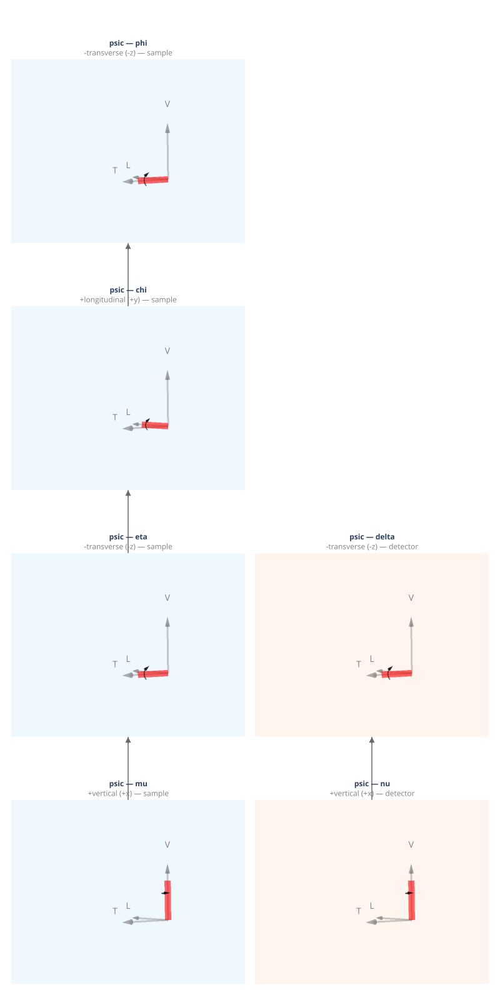

(geometry-psic)=
# psic — Eulerian Six-Circle, 4S+2D (You 1999)

You (1999) 4S+2D six-circle diffractometer. Four sample stages (mu, eta, chi, and phi) and two detector stages (nu, delta). Transverse detector, vertical scattering plane. Standard synchrotron six-circle.

**Coordinate basis:** You (1999) ({data}`~ad_hoc_diffractometer.factories.BASIS_YOU`): vertical=+x, longitudinal=+y, transverse=+z.

## Quick start

```python
import ad_hoc_diffractometer as ahd

g = ahd.presets.psic()
g.wavelength = 1.0  # Å
print(g.summary())
```

## Demo geometry definition

This geometry is defined by the {func}`~ad_hoc_diffractometer.presets.psic` factory
function — see the [source](https://github.com/prjemian/ad_hoc_diffractometer/blob/main/src/ad_hoc_diffractometer/factories.py#L454) for the complete stage
and mode configuration.

## Stage layout

<iframe
  src="../_static/geometries/psic/psic.html"
  width="100%"
  height="1630px"
  style="border:none;"
  loading="lazy">
</iframe>

```{raw} html
<details>
<summary>Static fallback (click to expand if the interactive figure above is blank)</summary>
```



```{raw} html
</details>
```

**Sample stages (base first):**

| Stage | Axis | Handedness | Parent |
|---|---|---|---|
| ``mu`` | +vertical (+x) | right-handed | base |
| ``eta`` | −transverse (−z) | left-handed | ``mu`` |
| ``chi`` | +longitudinal (+y) | right-handed | ``eta`` |
| ``phi`` | −transverse (−z) | left-handed | ``chi`` |

**Detector stages (base first):**

| Stage | Axis | Handedness | Parent |
|---|---|---|---|
| ``nu`` | +vertical (+x) | right-handed | base |
| ``delta`` | −transverse (−z) | left-handed | ``nu`` |

## Diffraction modes

Set the active mode with `g.mode_name = "<mode>"`.
Each mode is a {class}`~ad_hoc_diffractometer.mode.ConstraintSet` of 3 constraints
(N − 3 = 3 for N = 6 DOF).
See {doc}`../howto/modes` for usage and {doc}`../howto/constraints` for
changing constraint values at run time.

**Bisect pairs:**

- Vertical plane: eta (transverse) ↔ delta (transverse) → `eta = delta/2`
- Horizontal plane: mu (vertical) ↔ nu (vertical) → `mu = nu/2`

### `bisecting_vertical` *(default)*

{class}`~ad_hoc_diffractometer.mode.BisectConstraint` + {class}`~ad_hoc_diffractometer.mode.SampleConstraint` + {class}`~ad_hoc_diffractometer.mode.DetectorConstraint`:
`eta = delta/2`, `mu = 0`, `nu = 0`.
Vertical scattering plane bisecting condition (You 1999, §5.3).

| | |
|---|---|
| **Computed** | eta, chi, phi, delta |
| **Constant during** `forward()` | mu = 0, nu = 0 |

### `fixed_phi_vertical`

`phi` held at declared value (default 0°), `mu = 0`, `nu = 0`.
The scattering plane is locked vertical by `mu = 0` and `nu = 0`;
`eta`, `chi`, and `delta` are solved from the hkl equations.

| | |
|---|---|
| **Computed** | eta, chi, delta |
| **Constant during** `forward()` | phi, mu = 0, nu = 0 |

### `fixed_chi_vertical`

`chi` held at declared value (default 90°), `mu = 0`, `nu = 0`.
The caller chooses the chi value by constructing a {class}`~ad_hoc_diffractometer.mode.ConstraintSet` — see {doc}`../howto/constraints`.
The scattering plane is locked vertical by `mu = 0` and `nu = 0`;
`eta`, `phi`, and `delta` are solved from the hkl equations.

| | |
|---|---|
| **Computed** | eta, phi, delta |
| **Constant during** `forward()` | chi, mu = 0, nu = 0 |

### `fixed_alpha_i_vertical`

Incidence angle α_i fixed at declared value (default 0°) in the
vertical scattering plane.
Set ``g.surface_normal = (h, k, l)`` before calling ``forward()``.

| | |
|---|---|
| **Computed** | eta, chi, phi, delta |
| **Constant during** `forward()` | mu = 0, nu = 0 |
| **Extras (input)** | n̂ (surface normal) |

### `fixed_beta_out_vertical`

Exit angle β_out fixed at declared value (default 0°) in the
vertical scattering plane.
Set ``g.surface_normal = (h, k, l)`` before calling ``forward()``.

| | |
|---|---|
| **Computed** | eta, chi, phi, delta |
| **Constant during** `forward()` | mu = 0, nu = 0 |
| **Extras (input)** | n̂ (surface normal) |

### `alpha_eq_beta_vertical`

Symmetric reflection: α_i = β_out in the vertical scattering plane.
Set ``g.surface_normal = (h, k, l)`` before calling ``forward()``.

| | |
|---|---|
| **Computed** | eta, chi, phi, delta |
| **Constant during** `forward()` | mu = 0, nu = 0 |
| **Extras (input)** | n̂ (surface normal) |

### `fixed_psi_vertical`

Vertical bisecting with azimuthal angle ψ validation.
Set ``g.azimuthal_reference = (h, k, l)`` before calling ``forward()``.
The solver returns bisecting solutions only when the natural ψ for the
requested (h,k,l) matches the stored target.  See {doc}`../howto/surface`.

| | |
|---|---|
| **Computed** | eta, chi, phi, delta |
| **Constant during** `forward()` | mu = 0, nu = 0 |
| **Extras (input)** | n̂ (reference vector), ψ (target azimuth, degrees) |
| **Extras (output)** | psi (computed azimuth) |

### `double_diffraction_vertical`

Full 4D simultaneous solver in the vertical scattering plane: finds motor
angles where both the primary (h₁,k₁,l₁) and secondary (h₂,k₂,l₂)
reflections satisfy the Ewald sphere condition.  Set
``mode.extras['h2']``, ``['k2']``, ``['l2']`` before calling ``forward()``.

| | |
|---|---|
| **Computed** | eta, chi, phi, delta |
| **Constant during** `forward()` | mu = 0, nu = 0 |
| **Extras (input)** | h₂, k₂, l₂ (secondary reflection Miller indices) |

### `zone_vertical`

Zone mode (You 1999 §6, SPEC `setmode 5`).  The scattering vector Q is
confined to the plane spanned by two reciprocal-lattice vectors `z0`
and `z1`.  A `forward(h, k, l)` call:

1. Verifies the requested (h, k, l) lies in the zone plane (within
   `1e-6 · |Q|`).  Off-plane requests return an empty solution list and
   emit a warning.
2. Records the in-plane residual ``|Q · n_zone|`` in
   ``mode.extras['in_plane_residual']``.
3. Returns the bisecting solutions for in-plane reflections (mu = 0,
   nu = 0, eta = delta/2; chi and phi orient Q within the plane).

The remaining azimuthal degree of freedom around Q is the canonical
SPEC zone-mode scan (`cz`/`mz` macros) and is not exercised by a single
`forward()` call.

Set the zone-plane vectors before calling `forward()`:

```python
g.modes['zone_vertical'].extras['z0'] = (1, 0, 0)
g.modes['zone_vertical'].extras['z1'] = (0, 1, 0)
```

| | |
|---|---|
| **Computed** | eta, chi, phi, delta |
| **Constant during** `forward()` | mu = 0, nu = 0 |
| **Extras (input)** | z0, z1 (Miller-index 3-tuples) |
| **Extras (output)** | in_plane_residual |

### `bisecting_horizontal`

{class}`~ad_hoc_diffractometer.mode.BisectConstraint` + {class}`~ad_hoc_diffractometer.mode.SampleConstraint` + {class}`~ad_hoc_diffractometer.mode.DetectorConstraint`:
`mu = nu/2`, `eta = 0`, `delta = 0`.
Horizontal scattering plane bisecting condition (You 1999, §5.1).

| | |
|---|---|
| **Computed** | mu, chi, phi, nu |
| **Constant during** `forward()` | eta = 0, delta = 0 |

### `fixed_phi_horizontal`

`phi` held at declared value (default 0°), `eta = 0`, `delta = 0`.
The scattering plane is locked horizontal by `eta = 0` and `delta = 0`;
`mu`, `chi`, and `nu` are solved from the hkl equations.

| | |
|---|---|
| **Computed** | mu, chi, nu |
| **Constant during** `forward()` | phi, eta = 0, delta = 0 |

### `fixed_chi_horizontal`

`chi` held at declared value (default 0°), `eta = 0`, `delta = 0`.
The scattering plane is locked horizontal by `eta = 0` and `delta = 0`;
`mu`, `phi`, and `nu` are solved from the hkl equations.

The default chi value differs from the vertical counterpart
(`fixed_chi_vertical`, default 90°): with `eta = 0` the residual
psic sub-geometry places the chi-circle axis along the longitudinal
(beam) direction, so `chi = 0` is the value that keeps the phi axis
in the horizontal scattering plane.  The four-circle "spinning Q"
value `chi = 90°` tilts the phi axis out of the horizontal plane and
is kinematically infeasible in this mode.

| | |
|---|---|
| **Computed** | mu, phi, nu |
| **Constant during** `forward()` | chi, eta = 0, delta = 0 |

### `fixed_alpha_i_horizontal`

Incidence angle α_i fixed at declared value (default 0°) in the
horizontal scattering plane.
Set ``g.surface_normal = (h, k, l)`` before calling ``forward()``.

| | |
|---|---|
| **Computed** | mu, chi, phi, nu |
| **Constant during** `forward()` | eta = 0, delta = 0 |
| **Extras (input)** | n̂ (surface normal) |

### `fixed_beta_out_horizontal`

Exit angle β_out fixed at declared value (default 0°) in the
horizontal scattering plane.
Set ``g.surface_normal = (h, k, l)`` before calling ``forward()``.

| | |
|---|---|
| **Computed** | mu, chi, phi, nu |
| **Constant during** `forward()` | eta = 0, delta = 0 |
| **Extras (input)** | n̂ (surface normal) |

### `alpha_eq_beta_horizontal`

Symmetric reflection: α_i = β_out in the horizontal scattering plane.
Set ``g.surface_normal = (h, k, l)`` before calling ``forward()``.

| | |
|---|---|
| **Computed** | mu, chi, phi, nu |
| **Constant during** `forward()` | eta = 0, delta = 0 |
| **Extras (input)** | n̂ (surface normal) |

### `fixed_psi_horizontal`

Horizontal bisecting with azimuthal angle ψ validation.
Set ``g.azimuthal_reference = (h, k, l)`` before calling ``forward()``.

| | |
|---|---|
| **Computed** | mu, chi, phi, nu |
| **Constant during** `forward()` | eta = 0, delta = 0 |
| **Extras (input)** | n̂, ψ |
| **Extras (output)** | psi |

### `double_diffraction_horizontal`

Full 4D simultaneous solver in the horizontal scattering plane.

| | |
|---|---|
| **Computed** | mu, chi, phi, nu |
| **Constant during** `forward()` | eta = 0, delta = 0 |
| **Extras (input)** | h₂, k₂, l₂ (secondary reflection Miller indices) |

### `zone_horizontal`

Horizontal-plane analog of `zone_vertical`.  Locks `eta = 0`,
`delta = 0`; the bisecting condition `mu = nu/2` together with chi,
phi solves any in-plane (h, k, l).

Note that horizontal-plane reachability depends on the orientation of
the zone plane relative to the lab frame.  The `(h, k, 0)` reciprocal
plane (z0=(1,0,0), z1=(0,1,0)) is generally not reachable in the
horizontal scattering geometry under the You (1999) basis convention;
choose a plane that contains a vertical reciprocal direction
(e.g. z0=(1,0,0), z1=(0,0,1)) for reachable horizontal-plane work.

| | |
|---|---|
| **Computed** | mu, chi, phi, nu |
| **Constant during** `forward()` | eta = 0, delta = 0 |
| **Extras (input)** | z0, z1 (Miller-index 3-tuples) |
| **Extras (output)** | in_plane_residual |

### `lifting_detector_phi`

Out-of-plane mode: phi and mu frozen, nu and delta solved via the qaz
constraint (``tan(qaz) = tan(delta) / sin(nu)``, You 1999 eq. 18).
``qaz = 90°`` constrains the scattering to the vertical plane.

| | |
|---|---|
| **Computed** | phi, nu, delta |
| **Constant during** `forward()` | phi = 0, mu = 0 |

### `lifting_detector_mu`

Out-of-plane mode: mu and eta frozen, nu and delta solved via the qaz
constraint (``tan(qaz) = tan(delta) / sin(nu)``, You 1999 eq. 18).
``qaz = 90°`` constrains the scattering to the vertical plane.

| | |
|---|---|
| **Computed** | mu, nu, delta |
| **Constant during** `forward()` | mu = 0, eta = 0 |

## Mode cross-reference

Each `psic` mode mapped to its closest analog in SPEC's `psic` macros,
the Hkl/Soleil `E6C` `hkl` engine, and You (1999).

| mode | SPEC `psic` | Hkl/Soleil E6C | You (1999) |
|---|---|---|---|
| `bisecting_vertical` | `(2,0,5,0,0)` | `bissector_vertical` | §5.1 |
| `fixed_phi_vertical` | `(2,0,4,2,0)` | `constant_phi_vertical` | §5.2 |
| `fixed_chi_vertical` | `(2,0,3,2,0)` | `constant_chi_vertical` | §5.2 |
| `fixed_alpha_i_vertical` | `(2,2,5,0,0)` | — | §6.1 |
| `fixed_beta_out_vertical` | `(2,3,5,0,0)` | — | §6.2 |
| `alpha_eq_beta_vertical` | `(2,1,5,0,0)` | — | §6.3 |
| `fixed_psi_vertical` | `(2,4,5,0,0)` | `psi_constant_vertical` | §6.4 |
| `double_diffraction_vertical` | — | `double_diffraction_vertical` | §6.5 |
| `zone_vertical` | `setmode 5` | (TODO `HklEngine "zone"`) | §6 |
| `bisecting_horizontal` | `(1,0,6,0,0)` | `bissector_horizontal` | §5.1 |
| `fixed_phi_horizontal` | `(1,0,4,1,0)` † | — | §5.2 |
| `fixed_chi_horizontal` | `(1,0,3,1,0)` † | — | §5.2 |
| `fixed_alpha_i_horizontal` | `(1,2,6,0,0)` | — | §6.1 |
| `fixed_beta_out_horizontal` | `(1,3,6,0,0)` | — | §6.2 |
| `alpha_eq_beta_horizontal` | `(1,1,6,0,0)` | — | §6.3 |
| `fixed_psi_horizontal` | `(1,4,6,0,0)` | `psi_constant_horizontal` | §6.4 |
| `double_diffraction_horizontal` | — | `double_diffraction_horizontal` | §6.5 |
| `zone_horizontal` | `setmode 5` | (TODO `HklEngine "zone"`) | §6 |
| `lifting_detector_phi` | `(3,0,4,2,0)` | `lifting_detector_phi` | §5.4 |
| `lifting_detector_mu` | `(3,0,1,2,0)` | `lifting_detector_mu` | §5.4 |

The SPEC tuple is `(g_mode1, g_mode2, g_mode3, g_mode4, g_mode5)`,
where `g_mode1` selects the scattering plane (1 = horizontal,
2 = vertical, 3 = qaz/lifting-detector), `g_mode2` selects an optional
reference-angle constraint (0 = none, 1 = α=β, 2 = α-fixed,
3 = β-fixed, 4 = ψ-fixed), and `g_mode3`–`g_mode5` fix specific motor
angles.

—: no documented analog exists in that package.

†: SPEC mode tuples flagged here are listed by the SPEC documentation
as currently not working (the eta-fixed + chi-fixed and eta-fixed +
phi-fixed combinations under `setmode d1 0 s1 s2`); the
`ad_hoc_diffractometer` implementation of these modes is independent of
SPEC and works as documented above.

References:
[SPEC `psic` macros](https://certif.com/spec_help/psic.html);
[Hkl/Soleil E6C](https://people.debian.org/~picca/hkl/hkl.html);
[Hkl source](https://repo.or.cz/hkl.git).

## API reference

- {func}`~ad_hoc_diffractometer.presets.psic`
- {class}`~ad_hoc_diffractometer.diffractometer.AdHocDiffractometer`
- {class}`~ad_hoc_diffractometer.mode.ConstraintSet`
- {class}`~ad_hoc_diffractometer.mode.BisectConstraint`
- {class}`~ad_hoc_diffractometer.mode.SampleConstraint`
- {class}`~ad_hoc_diffractometer.mode.DetectorConstraint`
- {class}`~ad_hoc_diffractometer.mode.ReferenceConstraint`
- {class}`~ad_hoc_diffractometer.mode.EwaldSphereViolation`
- {class}`~ad_hoc_diffractometer.mode.ConstraintViolation`

## References

- You, *J. Appl. Cryst.* **32**, 614–623 (1999). DOI: [10.1107/S0021889899001223](https://doi.org/10.1107/S0021889899001223)
- Walko, *Ref. Module Mater. Sci. Mater. Eng.* (2016).
