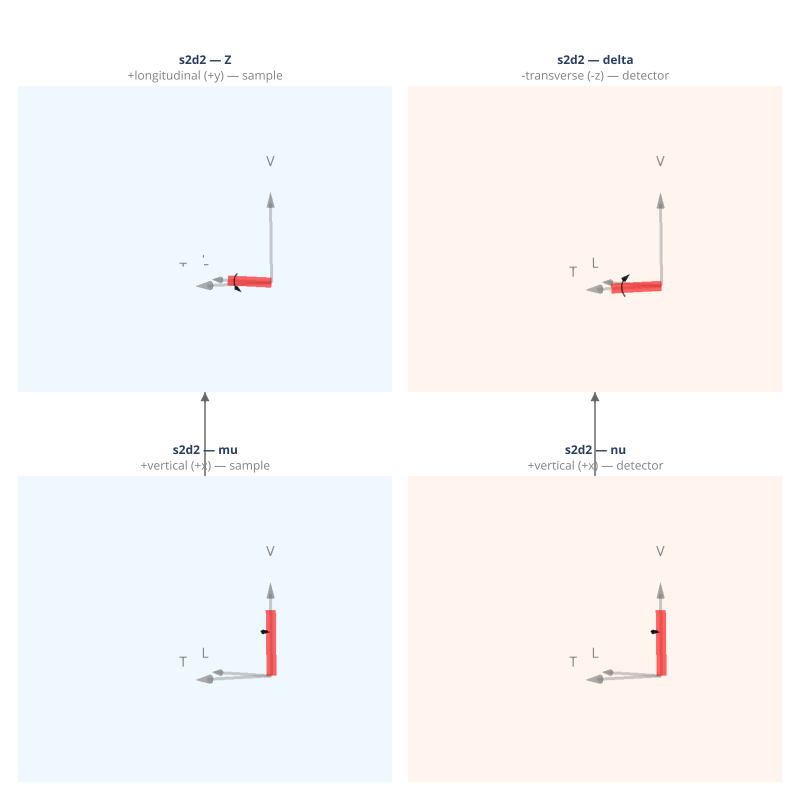

(geometry-s2d2)=
# s2d2 — S2D2 General-Inclination Four-Circle

S2D2 geometry with two independent sample axes (mu, Z) and two independent detector axes (nu, delta), all mechanically decoupled.

**Walko (2016) designation:** S2D2

**Coordinate basis:** You (1999) ({data}`~ad_hoc_diffractometer.factories.BASIS_YOU`): vertical=+x, longitudinal=+y, transverse=+z.

## Quick start

```python
import ad_hoc_diffractometer as ahd

g = ahd.presets.s2d2()
g.wavelength = 1.0  # Å
print(g.summary())
```

## Pre-built geometry definition

This geometry is defined by the {func}`~ad_hoc_diffractometer.presets.s2d2` factory
function — see the [source](https://github.com/prjemian/ad_hoc_diffractometer/blob/main/src/ad_hoc_diffractometer/factories.py#L1173) for the complete stage
and mode configuration.

## Stage layout

<iframe
  src="../_static/geometries/s2d2/s2d2.html"
  width="100%"
  height="830px"
  style="border:none;"
  loading="lazy">
</iframe>

```{raw} html
<details>
<summary>Static fallback (click to expand if the interactive figure above is blank)</summary>
```



```{raw} html
</details>
```

**Sample stages (base first):**

| Stage | Axis | Handedness |
|---|---|---|
| ``mu`` | +vertical (+x) | right-handed |
| ``Z`` | +longitudinal (+y) | right-handed |

**Detector stages (base first):**

| Stage | Axis | Handedness |
|---|---|---|
| ``nu`` | +vertical (+x) | right-handed |
| ``delta`` | −transverse (−z) | left-handed |

## Diffraction modes

Each mode is a {class}`~ad_hoc_diffractometer.mode.ConstraintSet` of 1 constraint
(N − 3 = 1 for N = 4 DOF).
See {doc}`../howto/constraints` for the constraint framework.

### `mu_fixed`

{class}`~ad_hoc_diffractometer.mode.SampleConstraint`:
`mu` held at declared value (default 0°) — the incidence angle when the
surface normal is aligned.
The caller chooses the value by constructing a
{class}`~ad_hoc_diffractometer.mode.ConstraintSet` — see
{doc}`../howto/constraints`.

| | |
|---|---|
| **Computed** | Z, nu, delta |
| **Constant during** `forward()` | mu |

### `reflectivity`

{class}`~ad_hoc_diffractometer.mode.ReferenceConstraint`:
symmetric reflection — incidence angle equals exit angle (alpha_i = beta_out).
Requires ``g.surface_normal = (h, k, l)`` — see {doc}`../howto/surface`.

| | |
|---|---|
| **Computed** | mu, Z, nu, delta |
| **Constant during** `forward()` | — |
| **Extras (input)** | n̂ (surface normal) |
| **Extras (output)** | alpha_i, beta_out |

## API reference

- {func}`~ad_hoc_diffractometer.presets.s2d2`
- {class}`~ad_hoc_diffractometer.geometry.AdHocDiffractometer`
- {class}`~ad_hoc_diffractometer.mode.ConstraintSet`
- {class}`~ad_hoc_diffractometer.mode.SampleConstraint`
- {class}`~ad_hoc_diffractometer.mode.ReferenceConstraint`
- {class}`~ad_hoc_diffractometer.mode.EwaldSphereViolation`
- {class}`~ad_hoc_diffractometer.mode.ConstraintViolation`

## References

- Evans-Lutterodt & Tang, *J. Appl. Cryst.* **28**, 318–326 (1995). DOI: [10.1107/S0021889895001063](https://doi.org/10.1107/S0021889895001063)
- Walko, *Ref. Module Mater. Sci. Mater. Eng.* (2016).
