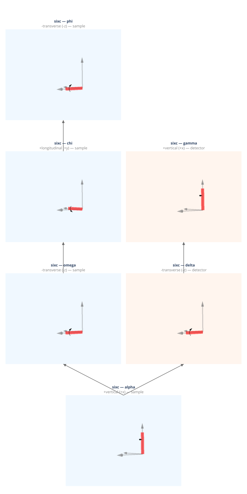

(geometry-sixc)=
# sixc — Eulerian Six-Circle, Surface (Lohmeier & Vlieg 1993)

Six-circle surface diffractometer. Sample and detector share a common alpha (rotary table) base stage. Supports both bulk crystallography (four-circle mode) and surface diffraction.

**Walko (2016) designation:** (S3D2)1

**Coordinate basis:** You (1999) ({data}`~ad_hoc_diffractometer.factories.BASIS_YOU`): vertical=+x, longitudinal=+y, transverse=+z.

## Quick start

```python
import ad_hoc_diffractometer as ahd

g = ahd.presets.sixc()
g.wavelength = 1.0  # Å
print(g.summary())
```

## Pre-built geometry definition

This geometry is defined by the {func}`~ad_hoc_diffractometer.presets.sixc` factory
function — see the [source](https://github.com/prjemian/ad_hoc_diffractometer/blob/main/src/ad_hoc_diffractometer/factories.py#L689) for the complete stage
and mode configuration.

## Stage layout

<iframe
  src="../_static/geometries/sixc/sixc.html"
  width="100%"
  height="1630px"
  style="border:none;"
  loading="lazy">
</iframe>

```{raw} html
<details>
<summary>Static fallback (click to expand if the interactive figure above is blank)</summary>
```



```{raw} html
</details>
```

**Sample stages (base first):**

| Stage | Axis | Handedness | Parent |
|---|---|---|---|
| ``alpha`` | +vertical (+x) | right-handed, shared base | base |
| ``omega`` | −transverse (−z) | left-handed | ``alpha`` |
| ``chi`` | +longitudinal (+y) | right-handed | ``omega`` |
| ``phi`` | −transverse (−z) | left-handed | ``chi`` |

**Detector stages (base first):**

| Stage | Axis | Handedness | Parent |
|---|---|---|---|
| ``delta`` | −transverse (−z) | left-handed | ``alpha`` |
| ``gamma`` | +vertical (+x) | right-handed | ``delta`` |

**Shared stage:** alpha (rotary table base shared between sample and detector stacks)

## Diffraction modes

Set the active mode with `g.mode_name = "<mode>"`.
Each mode is a {class}`~ad_hoc_diffractometer.mode.ConstraintSet` of 3 constraints
(N − 3 = 3 for N = 6 DOF).
See {doc}`../howto/modes` for usage and {doc}`../howto/constraints` for
changing constraint values at run time.

### `bisecting_4c` *(default)*

{class}`~ad_hoc_diffractometer.mode.SampleConstraint` + {class}`~ad_hoc_diffractometer.mode.DetectorConstraint` + {class}`~ad_hoc_diffractometer.mode.BisectConstraint`:
`alpha = 0`, `gamma = 0`, `omega = delta / 2`.
Reduces to standard four-circle bisecting geometry.

| | |
|---|---|
| **Computed** | omega, chi, phi, delta |
| **Constant during** `forward()` | alpha = 0, gamma = 0 |

### `fixed_gamma_5c`

{class}`~ad_hoc_diffractometer.mode.DetectorConstraint` + {class}`~ad_hoc_diffractometer.mode.SampleConstraint` + {class}`~ad_hoc_diffractometer.mode.BisectConstraint`:
`alpha = 0`, `omega = delta / 2`.
`gamma` is held at the value declared in the constraint (factory default: 0°).
The caller chooses the value by constructing a {class}`~ad_hoc_diffractometer.mode.ConstraintSet`; the constraint
persists until replaced — see {doc}`../howto/constraints`.

| | |
|---|---|
| **Computed** | omega, chi, phi, delta, alpha |
| **Constant during** `forward()` | gamma, alpha = 0 |

### `fixed_alpha_5c`

{class}`~ad_hoc_diffractometer.mode.SampleConstraint` + {class}`~ad_hoc_diffractometer.mode.BisectConstraint` + {class}`~ad_hoc_diffractometer.mode.DetectorConstraint`:
`omega = delta / 2`, `gamma = 0`.
`alpha` is held at the value declared in the constraint (factory default: 0°).
The caller chooses the value by constructing a {class}`~ad_hoc_diffractometer.mode.ConstraintSet`.

| | |
|---|---|
| **Computed** | omega, chi, phi, delta, gamma |
| **Constant during** `forward()` | alpha, gamma = 0 |

### `fixed_alpha_zaxis`

{class}`~ad_hoc_diffractometer.mode.SampleConstraint` × 2 + {class}`~ad_hoc_diffractometer.mode.ReferenceConstraint`:
Z-axis mode with fixed incidence angle. Requires ``g.surface_normal = (h, k, l)`` — see {doc}`../howto/surface`.

| | |
|---|---|
| **Computed** | omega, delta, gamma |
| **Constant during** `forward()` | alpha (= β_in), chi, phi |
| **Extras (input)** | n̂ (surface normal) |
| **Extras (output)** | alpha_i (incidence angle), beta_out (exit angle) |

### `fixed_beta_zaxis`

{class}`~ad_hoc_diffractometer.mode.DetectorConstraint` + {class}`~ad_hoc_diffractometer.mode.SampleConstraint` + {class}`~ad_hoc_diffractometer.mode.ReferenceConstraint`:
Z-axis mode with fixed exit angle. Requires ``g.surface_normal = (h, k, l)`` — see {doc}`../howto/surface`.

| | |
|---|---|
| **Computed** | omega, delta, alpha |
| **Constant during** `forward()` | gamma (= β_out), chi |
| **Extras (input)** | n̂ |
| **Extras (output)** | alpha_i, beta_out |

### `alpha_eq_beta_zaxis`

{class}`~ad_hoc_diffractometer.mode.SampleConstraint` × 2 + {class}`~ad_hoc_diffractometer.mode.ReferenceConstraint`:
Z-axis mode, symmetric reflection (α = γ, β_in = β_out). Requires ``g.surface_normal = (h, k, l)`` — see {doc}`../howto/surface`.

| | |
|---|---|
| **Computed** | omega, delta, alpha, gamma |
| **Constant during** `forward()` | chi, phi |
| **Extras (input)** | n̂ |
| **Extras (output)** | alpha_i, beta_out |

## API reference

- {func}`~ad_hoc_diffractometer.presets.sixc`
- {class}`~ad_hoc_diffractometer.geometry.AdHocDiffractometer`
- {class}`~ad_hoc_diffractometer.mode.ConstraintSet`
- {class}`~ad_hoc_diffractometer.mode.BisectConstraint`
- {class}`~ad_hoc_diffractometer.mode.SampleConstraint`
- {class}`~ad_hoc_diffractometer.mode.DetectorConstraint`
- {class}`~ad_hoc_diffractometer.mode.ReferenceConstraint`
- {exc}`~ad_hoc_diffractometer.mode.EwaldSphereViolation`
- {exc}`~ad_hoc_diffractometer.mode.ConstraintViolation`

## References

- Lohmeier & Vlieg, *J. Appl. Cryst.* **26**, 706–716 (1993). DOI: [10.1107/S0021889893006198](https://doi.org/10.1107/S0021889893006198)
- Walko, *Ref. Module Mater. Sci. Mater. Eng.* (2016).
