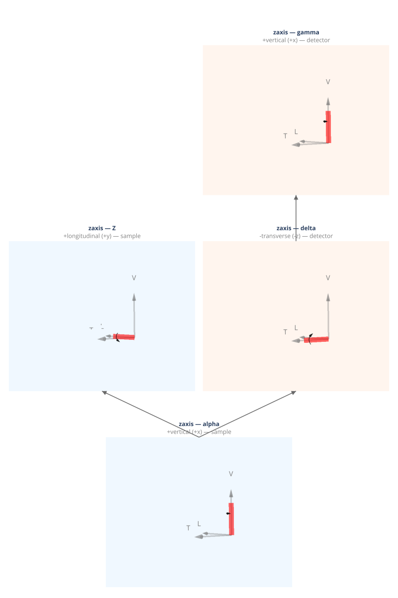

(geometry-zaxis)=
# zaxis — Z-Axis Four-Circle (Surface)

Z-axis four-circle diffractometer for surface diffraction. The sample surface normal is parallel to the Z-axis. Sample and detector share an alpha base stage.

**Walko (2016) designation:** (S1D2)1

**Coordinate basis:** You (1999) ({data}`~ad_hoc_diffractometer.factories.BASIS_YOU`): vertical=+x, longitudinal=+y, transverse=+z.

## Quick start

```python
import ad_hoc_diffractometer as ahd

g = ahd.presets.zaxis()
g.wavelength = 1.0  # Å
print(g.summary())
```

## Demo geometry definition

This geometry is defined by the {func}`~ad_hoc_diffractometer.presets.zaxis` factory
function — see the [source](https://github.com/prjemian/ad_hoc_diffractometer/blob/main/src/ad_hoc_diffractometer/factories.py#L1109) for the complete stage
and mode configuration.

## Stage layout

<iframe
  src="../_static/geometries/zaxis/zaxis.html"
  width="100%"
  height="1230px"
  style="border:none;"
  loading="lazy">
</iframe>

```{raw} html
<details>
<summary>Static fallback (click to expand if the interactive figure above is blank)</summary>
```



```{raw} html
</details>
```

**Sample stages (base first):**

| Stage | Axis | Handedness | Parent |
|---|---|---|---|
| ``alpha`` | +vertical (+x) | right-handed, shared base | base |
| ``Z`` | +longitudinal (+y) | right-handed | ``alpha`` |

**Detector stages (base first):**

| Stage | Axis | Handedness | Parent |
|---|---|---|---|
| ``delta`` | −transverse (−z) | left-handed | ``alpha`` |
| ``gamma`` | +vertical (+x) | right-handed | ``delta`` |

**Shared stage:** alpha (base stage shared between sample and detector stacks)

## Diffraction modes

Each mode is a {class}`~ad_hoc_diffractometer.mode.ConstraintSet` of 1 constraint
(N − 3 = 1 for N = 4 DOF).
Requires ``g.surface_normal = (h, k, l)`` — see {doc}`../howto/surface`.
See {doc}`../howto/constraints` for the extras dict pattern.

### `zaxis`

{class}`~ad_hoc_diffractometer.mode.ReferenceConstraint`:
surface normal aligned with the Z-axis; alpha directly equals the incidence
angle β_in, gamma directly equals the exit angle β_out.

| | |
|---|---|
| **Computed** | Z, delta, gamma |
| **Constant during** `forward()` | — |
| **Extras (input)** | n̂ (surface normal) |
| **Extras (output)** | alpha_i (= alpha), beta_out (= gamma) |

### `reflectivity`

{class}`~ad_hoc_diffractometer.mode.ReferenceConstraint`:
symmetric reflection — alpha_i = beta_out (alpha = gamma).

| | |
|---|---|
| **Computed** | Z, delta, alpha, gamma |
| **Constant during** `forward()` | — |
| **Extras (input)** | n̂ |
| **Extras (output)** | alpha_i, beta_out |

## API reference

- {func}`~ad_hoc_diffractometer.presets.zaxis`
- {class}`~ad_hoc_diffractometer.diffractometer.AdHocDiffractometer`
- {class}`~ad_hoc_diffractometer.mode.ConstraintSet`
- {class}`~ad_hoc_diffractometer.mode.ReferenceConstraint`
- {class}`~ad_hoc_diffractometer.mode.EwaldSphereViolation`
- {class}`~ad_hoc_diffractometer.mode.ConstraintViolation`

## References

- Bloch, *J. Appl. Cryst.* **18**, 33–36 (1985). DOI: [10.1107/S0021889885009858](https://doi.org/10.1107/S0021889885009858)
- Walko, *Ref. Module Mater. Sci. Mater. Eng.* (2016).
